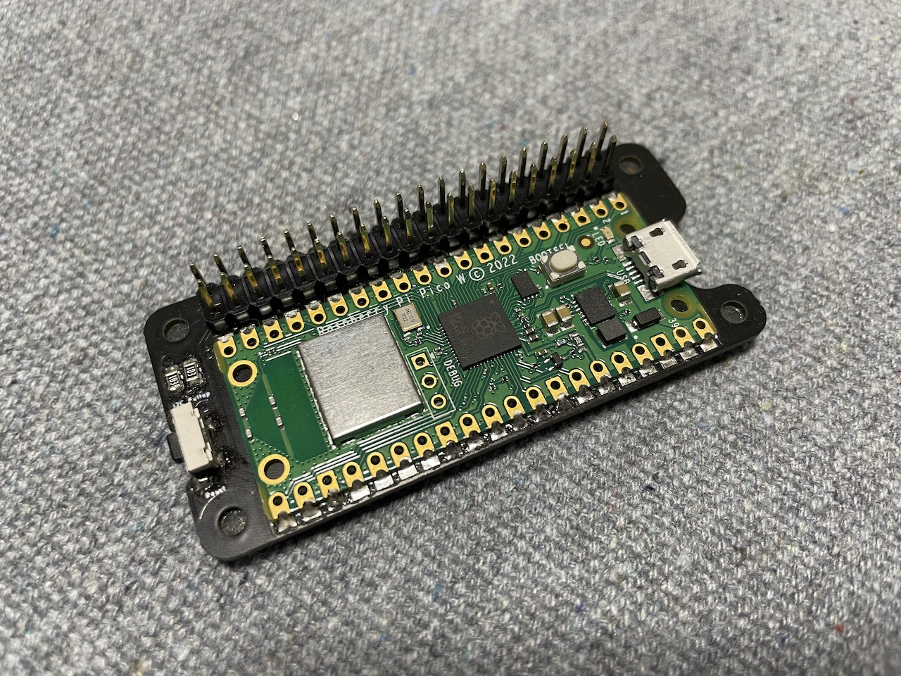
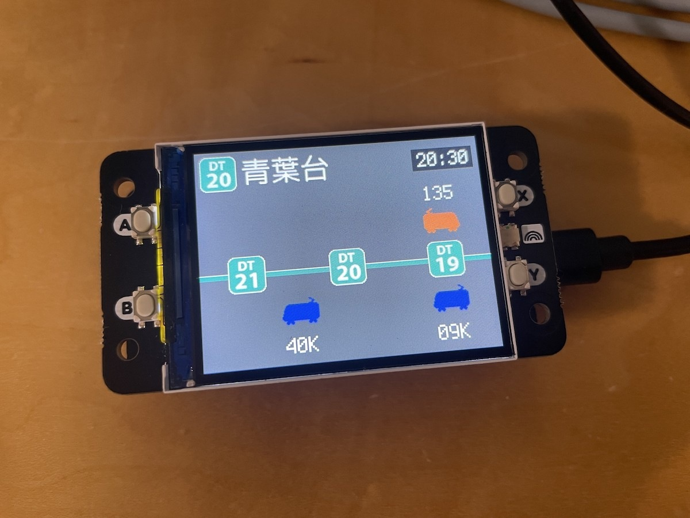

# uHAT Porter Pico

Raspberry Piの拡張ボードをRaspberry Pi Picoで遊ぶために、ピン配置を変換するuHATサイズのボードです。

I2C・SPI・電源などの一般的なポートがRaspberry Piに合わせて配置されているため、昔遊んだHATボードをRaspberry Pi Picoに移植できるかチャレンジする時などに便利です。

I2C用に10KΩのプルアップ抵抗と、リセットボタンを実装済みの状態で頒布しています。同人基板につき手で実装しています（実装後に検査済み）。

Raspberry Pi Pico（もしくはPico W）と2x20ピンヘッダーは各自で用意・はんだ付けが必要です。




※裏面のイラストは同人イベント頒布版のみです。委託版にはイラストはありません。

## ピン番号対応表 (Type-P Rev.3)

ピンの割当は以下の通り対応します。

| Pico   | Pi BCM   | Pi GPIO | Pi GPIO | Pi BCM    | Pico        |
| ------ | -------- | ------- | ------- | --------- | ----------- |
| 3V3    | 3V3      | 1       | 2       | 5V        | VBUS        |
| GPIO4  | BCM2_SDA | 3       | 4       | 5V        | VBUS        |
| GPIO5  | BCM3_SCL | 5       | 6       | GND       | GND         |
| GPIO3  | BCM4     | 7       | 8       | BCM14_TXD | GPIO0       |
| GND    | GND      | 9       | 10      | BCM15_RXD | GPIO1       |
| GPIO2  | BCM17    | 11      | 12      | BCM18     | GPIO21      |
| GPIO9  | BCM27    | 13      | 14      | GND       | GND         |
| GPIO8  | BCM22    | 15      | 16      | BCM23     | GPIO7       |
| 3V3    | 3V3      | 17      | 18      | BCM24     | GPIO6       |
| GPIO19 | BCM10    | 19      | 20      | GND       | GND         |
| GPIO16 | BCM9     | 21      | 22      | BCM25     | GPIO10      |
| GPIO18 | BCM11    | 23      | 24      | BCM8      | GPIO22      |
| GND    | GND      | 25      | 26      | BCM7      | GPIO17      |
| NC     |          | 27      | 28      |           | NC          |
| GPIO11 | BCM5     | 29      | 30      | GND       | GND         |
| GPIO12 | BCM6     | 31      | 32      | BCM12     | GPIO15      |
| GPIO13 | BCM13    | 33      | 34      | GND       | GND         |
| GPIO20 | BCM19    | 35      | 36      | BCM16     | GPIO26_ADC0 |
| GPIO14 | BCM26    | 37      | 38      | BCM20     | GPIO27_ADC1 |
| GND    | GND      | 39      | 40      | BCM21     | GPIO28_ADC2 |

過去のリビジョンのピン割り当て及び変更履歴は以下を参照してください。

* [Type-S](docs/revisions/type-s-rev-1.md)
* [Type-P Rev.1/Rev.2](docs/revisions/type-p-rev-1-and-2.md)
* [Type-P Rev.3](docs/revisions/type-p-rev-3.md)

## 頒布について

現在は同人イベントでの出店を中心に頒布中しつつ、スイッチサイエンスさんにて委託販売中です。

* [スイッチサイエンス販売ページ](https://www.switch-science.com/products/9364)

## 組み立て手順

[こちらを参照してください](docs/assembly-instructions.md)

## CircuitPython サンプル

### ピン番号読み替え変換ライブラリ

example/(micro|circuit)python/lib 以下にある uhat_porter_type_p3.py を board_bcm としてインポートすると、board_bcm.BCM4 のようにRaspberry PiのBCM番号として扱えます（過去のリビジョンをお持ちの場合は読み込みライブラリを適宜変更してください）。

```
# 必要に応じて入れ替え
#import uhat-porter_type_s as board_bcm
#import uhat-porter_type_p as board_bcm
import uhat-porter_type_p3 as board_bcm


button = digitalio.DigitalInOut(board_bcm.BCM4)
button.switch_to_input(pull=digitalio.Pull.UP)

while True:
    if not button.value:
        print("pressed!")
```

### サンプル一覧

| スクリプト名  | 解説 |
| ------------- | ---- |
| blinkt.py     | PimoroniのBlinkt!を動かすサンプルです。Type-P Rev.1/Rev.2の場合は点滅が遅くなります。 |
| keybow.py     | PimoroniのKewbowおよびKeybow Miniを動かすサンプルです。keybow_config.pyでキーの定義を編集します。LED点滅に対応。 |
| spi_096_160x80_lcd_bo.py | Pimoroniの0.96" SPI Colour LCD (160x80) Breakoutを動かすサンプルです |
| unicornhat.py | PimoroniのUnicorn HATを動かすサンプルです。 |
| unicornhatmini.py | PimoroniのUnicorn HAT Miniを動かすサンプル兼ライブラリです。オリジナルのライブラリを改変してあります |
| unicornhatmini_doteditor.py | Unicorn HAT MiniをWebブラウザから操作して遊ぶドット絵エディターのサンプルです。PicoWを実装したボードと、unicornhatmini.pyが必要です。 |

ここに書き忘れているサンプルもいくつかあります。

## 動作確認済みボード

### Pimoroni

* 0.96" SPI Colour LCD (160x80) Breakout
* BLINKT!
    * Type-SもしくはType-P Rev.3を推奨
* BME280 Breakout
* Display HAT Mini
* Four Letter pHAT
* Keybow
* Keybow Mini
* Unicorn HAT
* Unicorn HAT Mini
* Scroll pHAT HD
* LED Shim
    * CircuitPythonではType-P Rev.3が必要
    * Adafruitのサンプルにピン番号読み替え変換ライブラリを組み合わせで動作

Display HAT Miniの組み合わせ例



LED Shimの動作デモ（動画）

[](https://www.youtube.com/watch?v=A4wwtv1Ayxs)

Blinkt!の動作デモ（動画）

[](https://www.youtube.com/watch?v=NRVWUoWUhiE)

## License

Copyright (C) 2022,2023 Akkiesoft
MIT License