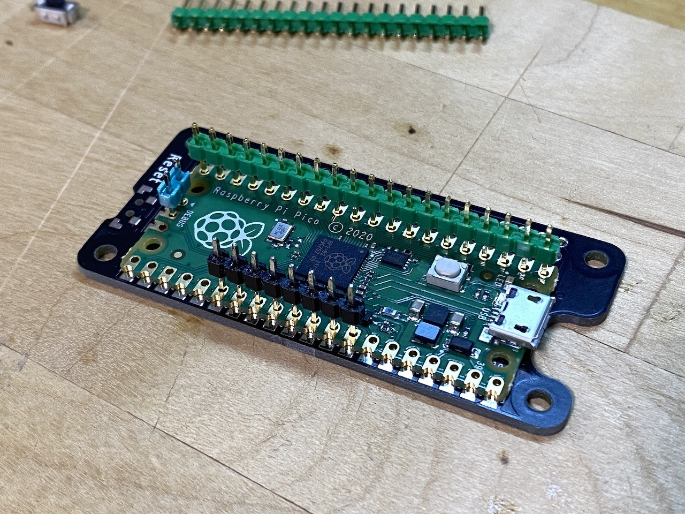
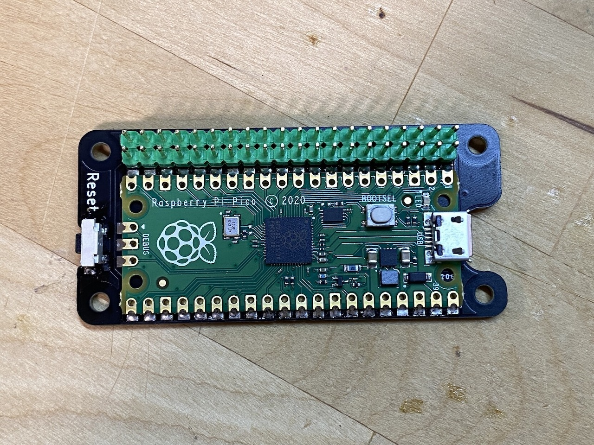
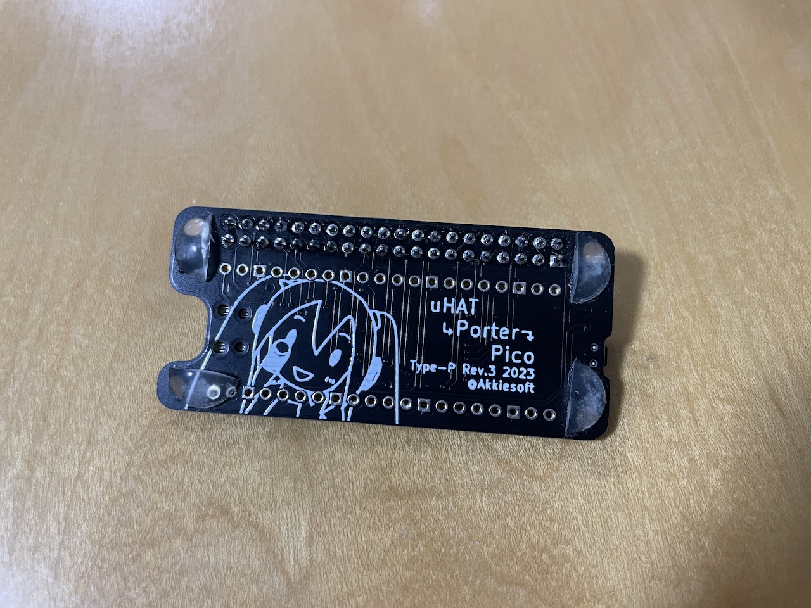
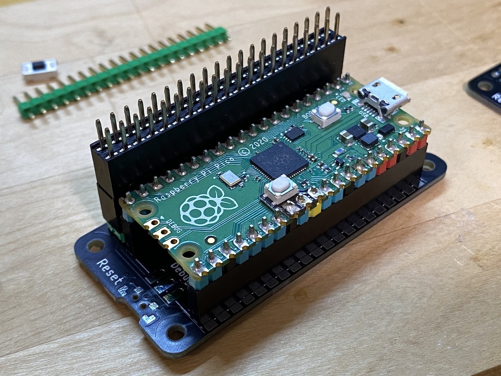

# uHAT Porter Pico 組み立て手順

## 必要なもの

* Raspberry Pi Pico（あるいはPico W）
* 2x20 ピンヘッダー
* ゴム足（任意）
* はんだごて と はんだ

プルアップ抵抗とリセット用のボタンスイッチは実装済みです。ボタンスイッチを交換する場合は、AliExpressにある「TS-B001」の「3x3.6x3.8」サイズが適合します。必要に応じて入手してください。

https://ja.aliexpress.com/item/4001013178307.html

## Raspberry Pi Picoのはんだ付け

はじめにPicoをはんだ付けします。きれいに載せるには、適当なピンヘッダーを何ヶ所かスルーホールに刺して仮止めするのがおすすめです。仮止めした状態で、ピンを刺していない場所をいくつかはんだ付けし、固定できたら仮止めしたピンを外して残りをはんだ付けします。

はんだは、パッドの上に適量を載せてから、Picoの側面の溝をはんだごてでなぞるようにして離すときれいに付きます。

## 2x20 ピンヘッダーのはんだ付け

GPIOピンとなるの2x20 ピンヘッダーをはんだ付けします。端の1箇所だけはんだ付けしたあと、ピンヘッダーが斜めについていないか確認してから残りをはんだ付けするときれいに取り付け可能です。

## 任意でゴム足の貼り付け

ゴム足は100円ショップで入手可能です。底面に貼り付けると設置時に安定します。ゴム足は必要に応じてハサミでカットして貼り付けます。

## 応用

Raspberry Pi Picoを直接実装するかわりに1x20 ピンソケットを実装すると、すでにピンヘッダーが実装されたPicoを使用できます。ただし、HATボードが直接載せられなくなるため、Booster Headerが1〜2個必要になります。

https://shop.pimoroni.com/products/booster-header

