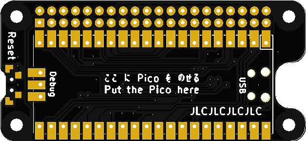
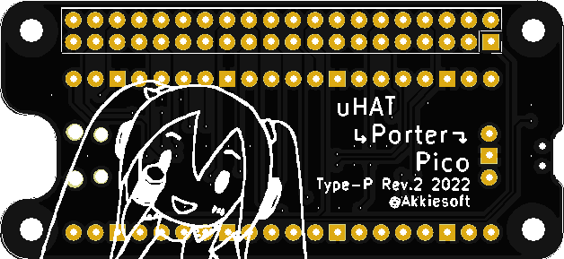

# uHAT Porter Pico Type-P Rev.1/Rev.2

I2CとSPIポートについてはPimoroni社のBreakout Gardenに準じたピン配置としつつ、それ以外のポートを適宜配置したバージョンです。Raspberry Pi向けに発売されたBreakout Gardenのベースボードが、Raspberry Pi Picoでも同じピン番号で扱うことが可能です。

### ピン番号対応表

| Pico   | Pi BCM   | Pi GPIO | Pi GPIO | Pi BCM    | Pico        |
| ------ | -------- | ------- | ------- | --------- | ----------- |
| 3V3    | 3V3      | 1       | 2       | 5V        | VBUS        |
| GPIO4  | BCM2_SDA | 3       | 4       | 5V        | VBUS        |
| GPIO5  | BCM3_SCL | 5       | 6       | GND       | GND         |
| GPIO3  | BCM4     | 7       | 8       | BCM14_TXD | GPIO0       |
| GND    | GND      | 9       | 10      | BCM15_RXD | GPIO1       |
| GPIO2  | BCM17    | 11      | 12      | BCM18     | GPIO21      |
| GPIO6  | BCM27    | 13      | 14      | GND       | GND         |
| GPIO7  | BCM22    | 15      | 16      | BCM23     | GPIO8       |
| 3V3    | 3V3      | 17      | 18      | BCM24     | GPIO9       |
| GPIO19 | BCM10    | 19      | 20      | GND       | GND         |
| GPIO16 | BCM9     | 21      | 22      | BCM25     | GPIO10      |
| GPIO18 | BCM11    | 23      | 24      | BCM8      | GPIO22      |
| GND    | GND      | 25      | 26      | BCM7      | GPIO17      |
| NC     |          | 27      | 28      |           | NC          |
| GPIO11 | BCM5     | 29      | 30      | GND       | GND         |
| GPIO12 | BCM6     | 31      | 32      | BCM12     | GPIO15      |
| GPIO13 | BCM13    | 33      | 34      | GND       | GND         |
| GPIO20 | BCM19    | 35      | 36      | BCM16     | GPIO26_ADC0 |
| GPIO14 | BCM26    | 37      | 38      | BCM20     | GPIO27_ADC1 |
| GND    | GND      | 39      | 40      | BCM21     | GPIO28_ADC2 |